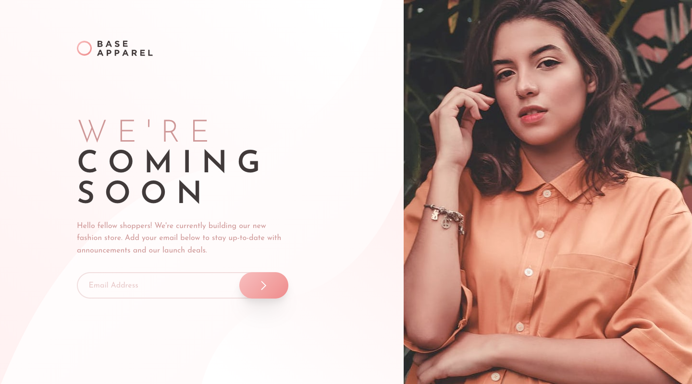

# Frontend Mentor - Base Apparel coming soon page solution

This is a solution to the [Base Apparel coming soon page challenge on Frontend Mentor](https://www.frontendmentor.io/challenges/base-apparel-coming-soon-page-5d46b47f8db8a7063f9331a0). Frontend Mentor challenges help you improve your coding skills by building realistic projects.

## Table of contents

- [Overview](#overview)
  - [The challenge](#the-challenge)
  - [Screenshot](#screenshot)
  - [Links](#links)
- [My process](#my-process)
  - [Built with](#built-with)
  - [What I learned](#what-i-learned)
  - [Useful resources](#useful-resources)
- [Author](#author)

## Overview

### The challenge

Users should be able to:

- View the optimal layout for the site depending on their device's screen size
- See hover states for all interactive elements on the page
- Receive an error message when the `form` is submitted if:
  - The `input` field is empty
  - The email address is not formatted correctly

### Screenshot

#### Desktop Layout

#### Mobile Layout

### Links

- Solution URL: [Frontend Mentor](https://www.frontendmentor.io/solutions/base-apparel-coming-soon-page-with-scss-and-bem-jWhMLtekL)
- Live Site URL: [Cloudflare Pages](https://mbr-challenge-apparel-coming-soon.pages.dev/)

## My process

### Built with

- HTML / CSS
- SASS
- Flexbox
- CSS Grid
- SVG
- Mobile-first

### What I learned

This was a really fun challenge that reminded me how much I love CSS Grid. I do my best to use flexbox instead of grid for most things, but I really need to swap over to grid earlier sometimes to get a better responsive layout.

### Useful resources

- [.visually-hidden CSS class](https://www.a11ywithlindsey.com/blog/introduction-accessible-labeling) - This article helped with a `.visually-hidden` CSS class which visually hides elements but still allows them to be seen by screen readers. This class was used on the label for email address input to ensure screen readers are able to read this out, as only a placeholder was specified in the design.

## Author

- Frontend Mentor - [@ruuen](https://www.frontendmentor.io/profile/ruuen)
- Twitter - [@maxruuen](https://www.twitter.com/maxruuen)
